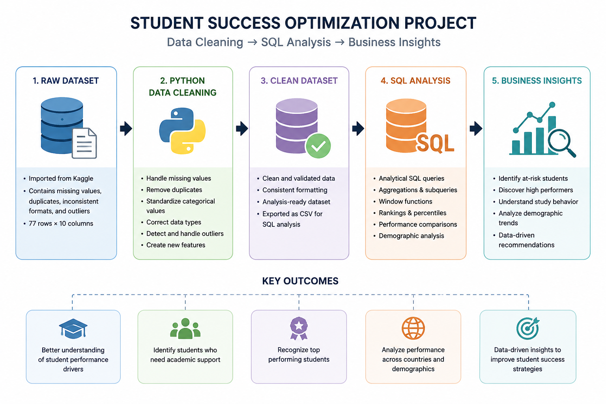

# Student Success Optimization | SQL & Data Cleaning Project
---



---

## Project Overview

This project focuses on analyzing student academic performance, study behavior, and demographic trends using Python and SQL.

The workflow begins with cleaning and preparing a raw dataset containing real-world data quality issues. After the cleaning process, the dataset is analyzed in SQL to uncover patterns related to academic success, study habits, technical performance, and potential academic support needs.

The project simulates a real business intelligence workflow:

Raw Dataset → Data Cleaning (Python) → SQL Analysis → Business Insights

---

## Business Problem

Educational institutions often struggle to identify:

- Students at academic risk
- High-performing student groups
- Study behavior patterns
- Demographic trends associated with performance
- Whether admission scores predict future success

This project aims to answer those questions through data cleaning and analytical SQL queries.

---

## Dataset Information

### Source

Dataset obtained from Kaggle:

https://www.kaggle.com/datasets/walekhwatlphilip/intro-to-data-cleaning-eda-and-machine-learning

### Dataset Description

The dataset contains student-related information such as:

- First and last name
- Age
- Gender
- Country and residence
- Previous education
- Study hours
- Entry exam scores
- Python scores
- Database scores

The original dataset intentionally contains several data quality problems commonly found in real-world analytics projects.

---

# Data Cleaning Process (Python)

The dataset was cleaned and prepared using Python and Pandas.

### Cleaning Tasks Performed

- Missing value handling
- Duplicate detection
- Categorical standardization
- Data type correction
- Outlier detection
- Data validation
- Exporting the cleaned dataset for SQL analysis

### Technologies Used

- Python
- Pandas
- Jupyter Notebook

---

# SQL Analysis

The cleaned dataset was analyzed using SQL to answer business-oriented questions related to student performance and behavior.

### Key Analysis Areas

- Academic performance analysis
- Study behavior analysis
- Demographic analysis
- Technical skill evaluation
- Institutional benchmarking
- Student ranking and segmentation

### SQL Concepts Used

- Aggregations
- Subqueries
- CASE statements
- Views
- Common Table Expressions (CTEs)
- Window Functions
- Ranking Functions
- Analytical Queries

---

# Example Business Questions

- Which students achieved above-average technical performance?
- Which students study many hours but still perform poorly?
- Which countries show the highest study commitment?
- Do entry exam scores correlate with academic success?
- Which demographic groups may require academic support?
- Which students belong to the top 10% academically?

---

# Key Insights

### 1. Study Commitment Does Not Always Guarantee Strong Performance

Several students with above-average study hours still performed below the institutional academic benchmark, suggesting possible inefficiencies in study methods or learning difficulties.

### 2. Academic Performance Varies Across Demographic Groups

Student performance showed noticeable variation across countries and demographic segments, indicating differences in educational preparation and academic background.

### 3. Entry Exam Scores Are Not Fully Reliable Predictors

Some students with low admission scores achieved strong academic performance, while others with high entry scores underperformed academically.

### 4. Technical Skill Gaps Were Identified

Several students displayed large performance differences between Python and Database subjects, suggesting uneven technical specialization.

### 5. High-Performing Students Were Clearly Identified

Using ranking and window functions, the project identified the top-performing students relative to institutional benchmarks.

---

# Tools & Technologies

| Category | Tools |
|---|---|
| Data Cleaning | Python, Pandas, jupyter Notebook |
| Analysis | SQL |

---

# Learning Outcomes

Through this project, I practiced:

- Real-world data cleaning
- SQL analytical querying
- Business-oriented analysis
- Window functions and ranking logic
- Data storytelling
- Structuring portfolio analytics projects
  
---

# Project Structure

```text
Student-Success-Optimization/
│
├── data/
│   ├── raw/
│   │   └── bi.csv
│   │
│   └── cleaned/
│       └── CleanedBIExploration.csv
│
├── notebooks/
│   └── Student_Success_Data_Cleaning.ipynb
│
├── sql/
│   └── Student_Success_Analysis.sql
│
├── README.md
│
└── images/
    └── project-preview.png
```
---

# Author

Aaron Diaz

Aspiring Data Analyst | SQL • Python • Power BI
